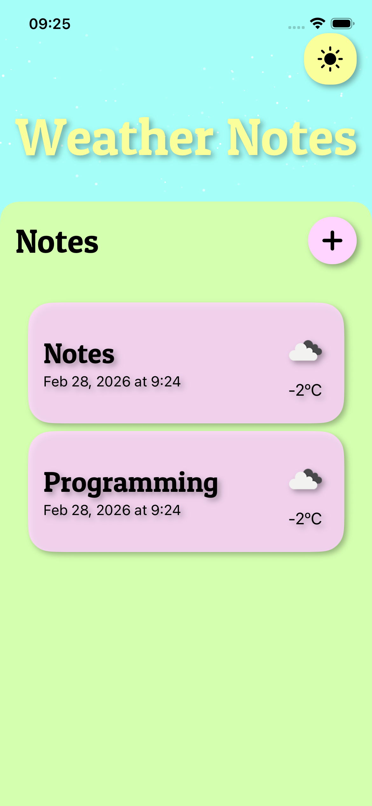
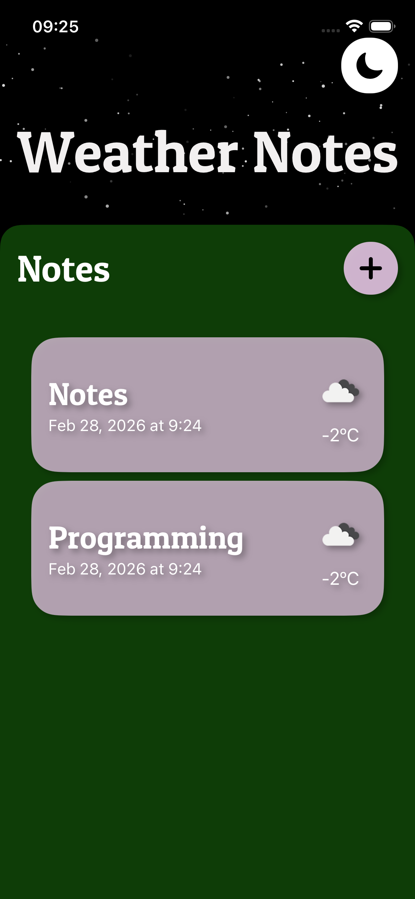

# WeatherNotes🌤️📝

## Features
* **Note Creation:** Easily add notes with custom titles.
* **Real-time Weather:** Automatically fetches current weather data using the OpenWeather API based on device location (or defaults to Kyiv).
* **Local Storage:** All notes are safely persisted on the device using CoreData.
* **Dark Mode Support:** Custom color palettes implemented via Asset Catalogs for seamless Light/Dark mode transitions.

## Screenshots
| Light Theme | Dark Theme | Add Note |
|:---:|:---:|:---:|
|  |  |  |

## How to Run
1. Clone the repository: `git clone [https://github.com/KeeRReeK/WeatherNotes]`
2. Open `WeatherNotes.xcodeproj` in Xcode 15+.
3. In `WeatherService.swift`, replace `API_KEY` with your valid OpenWeather API key.
4. Run the project on a simulator or real device.
